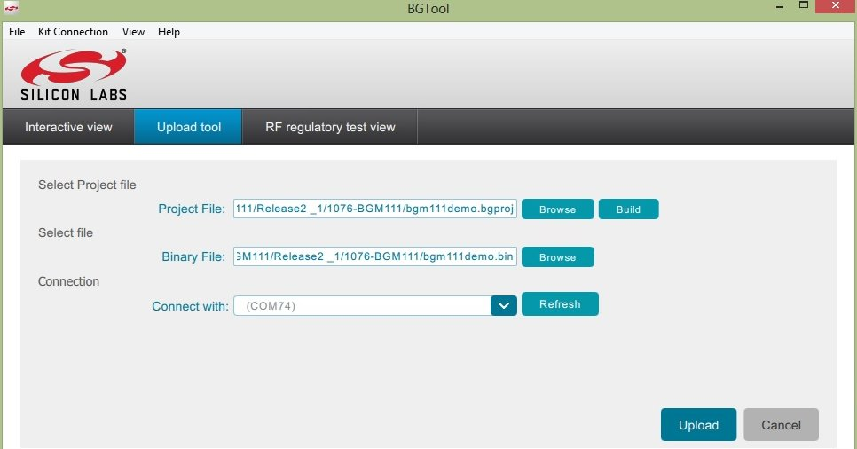

.. index:: development

.. _develop:

Developing guide
----------------

This page explain how to develop under *Windows* with the **BG Tool** showing where download, install and use it. To program the BGM111 is necessary not only the SiliconLab Sensor Node itself but also the board named **PCB4001**.

Installing
**********

The software could be dowloaded from the `silabs website <https://www.silabs.com/products/wireless/bluetooth/Pages/bluetooth-smart-software.aspx>`_ the version used in this guide is `v0.9.2-446 <https://www.silabs.com/Support%20Documents/RegisteredDocs/bgm-0.9.2-446.exe>`_. In the silabs webpage you can find under the *download now* documents about BGScript, BGAPI, and example applications.
Once it downloaded install following default options.

PCB4001
*******

This board is needed to program the firmware in the **SiliconLab Sensor Node**. Without this hardware is not possible flash the BGM111. It is necessary also make connections from the connector of the board with the device. To make this connections please follow this scheme:

Pefore to continue, connect the **SiliconLab Sensor Node** to the **PCB4001** and connect the PC to to the **PCB4001**. Windows will install a virtual COM when recognizes the board.

The Project
***********

The project is developted with the **BGScript**. This language is compiled by **BGTool** and interpreted by **BGM111**. To know details about this programming language we suggest to read the specific document `Bluetooth Smart BGScript Developer Guide <http://www.hmangas.com/Electronica/Datasheets/Bluetooth%20Module/BLE112/Bluetooth+Smart+BGScript+Developer+Guide.pdf>`_ and read about the API functions with the document `BGM API Reference Guide <https://www.silabs.com/Support%20Documents/RegisteredDocs/BGM111-API-RM.pdf>`_.
Summarizaring the BGScript is a simple event-driven BASIC-like application scripting language. It abstracts away the complexity of bluetooth development, embedded programming and hardware interfaces. This kind of design enables fast, simple firmware development into BGM111 module. Obviously it is not needed external MCU.

The BGScript project include several files:

- bgm111demo.bgproj: index file project, it is written all the files included in the project. The **BGTool** uses this file to open the project.
- hardware.xml: definitions of the hardware configuration, UART settings, GPIO uses,...
- gatt.xml: gatt specification used by the bluetooth pheriperal.
- bgm111demo.bgs: main source code, entry point of the firmare.
- peripheral.bgs: source code to comunicate with the sensors by I2C.

Now, to compile the project first up, download from `architechboards website <http://architechboards.org/>`_ the source code of the project. Extract it and launch **BGTool**. Select the COM connected to the **PCB4001** board.

After that, go to the menu clicking on *View->Upload Tool*.

Will appear a new window where to open the project file.

 
Before to build the project select where put the binary file, this file will be uploaded into the **BGM111**.
The last step, is flash the firmware, to do this verify that all the connections are steady and click on *Upload* button. In few seconds the board will be programmed. Reset the device in order to run the new firmware uploaded.

