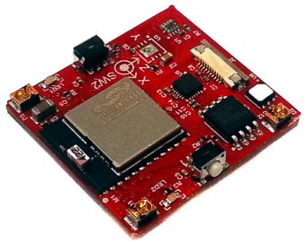

.. RN2483_Silica documentation master file

Welcome to SiliconLabs Sensor Node documentation!
=================================================

:Version: 1.00B
:Copyright: (C)2016 Silica an Avnet company
:Date: 23 Mar 2016
:Reference name: 

Silicon Labs' Smallest, Lowest Power Bluetooth Smart Module
-----------------------------------------------------------

.. index:: index

**INTRODUCTION**
----------------

The SiliconLabs Sensor Node has the **BGM111** device that is a Bluetooth® Smart module targeted for Bluetooth Smart applications.
That permits good RF performance, low power consumption and easy application development as key requirements. 
At +8 dBm TX power BGM111 has best-in-class RF performance and can provide long range, robust Bluetooth Smart connectivity.
This device integrates all of the necessary elements required for a Bluetooth Smart application: Bluetooth radio, software stack and GATT based profiles and it can also host end user applications, which means no external microcontroller is required in size, price or power constrained devices.
SiliconLabs Sensor Node has several sensors connected to the BGM111 Bluetooth Smart module, thanks its highly flexible hardware interface to connect to different peripherals.
Another valuable characteristic is the ultra-low power consumption that permits to operating using a standard 3V coin cell battery.

This board shows you the capability of the **BGM111** sending data by Bluetooth read from the sensors of:

- Temperature
- Accelerometer
- Magnetometer
- Gyroscope
- Ambient Light
- Proximity

**BGM111** Features:

- Bluetooth 4.1 Compliant (Bluetooth Smart)
- Software upgradable to Bluetooth 4.2
- TX power: up to +8 dBm
- RX sensitivity: down to -93 dBm
- Range: up to 200 meters
- CPU core: 32-bit ARM® Cortex-M4
- Flash memory: 256 kB
- RAM: 32 kB
- Autonomous Hardware Crypto Accelerator and True Random Number Generator
- Integrated DC-DC Converter

Developement tools
******************

Firmware developed using:
**Blue Gecko Software**, for installation and configuration of the project, follow instruction inside :ref:`develop`

Document references
*******************

The board reference documentation is available on the `architech-board <http://architechboards.org>`_ website. 

Contents:

.. toctree::
   :maxdepth: 2

   qs
   develop
   hw

