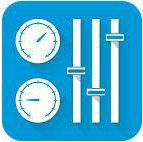
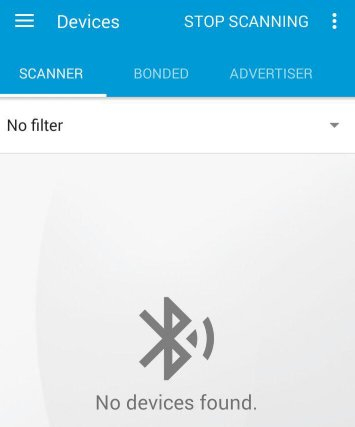
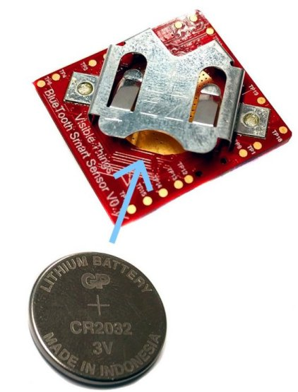
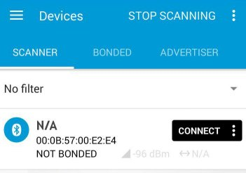
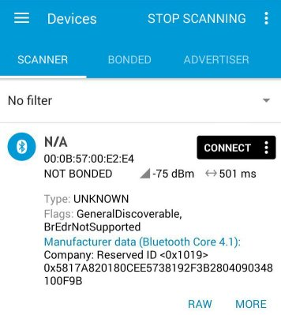

.. index:: qs

.. _quick:

Quick start guide
-----------------

This guide shows you what kind of data are sent by the **SiliconLabs Sensor Node**.
in order to follow the next steps it is necessary to use an Android phone.

1. Install the application **nRF Master Control Panel** from **Google Play Store**.

2. Launch the installed application and go to **Scanner** tab. At the first time no device will be seen. Turn on the Bluetooth from the settings of your phone.

3. Turn on the **SiliconLabs Sensor Node** board inserting the battery.

4. The **nRF Master Control Panel** will find out the device.

5. To see the details of the frame sent by the device found, touch on the row just showed.

6. Every 2 seconds the SiliconLab Sensor Node will send a new frame with the last data read from the sensors. To understand what are these numbers here there is a simple schema:

=====  ============
Bytes  Significance
=====  ============
0x58   Temperature
T      signed value from -20 to +40 celsius
0xA8   Humidity
H      Humidity in %, scale 100%, unit 1%
0x18   Accelerometer
X      2'complement value in units of 0.01g
Y      2'complement value in units of 0.01g
Z      2'complement value in units of 0.01g
0x38   Magnetometer
X      2' complement value in units of 10-6T 
Y      2' complement value in units of 10-6T
Z      2' complement value in units of 10-6T
0x28   Gyroscope
X      2' complement value in units od 0.1deg/s
Y      2' complement value in units od 0.1deg/s
Z      2' complement value in units od 0.1deg/s
0x48   Ambient light & Proximity
A      units ok klux 
P
=====  ============

